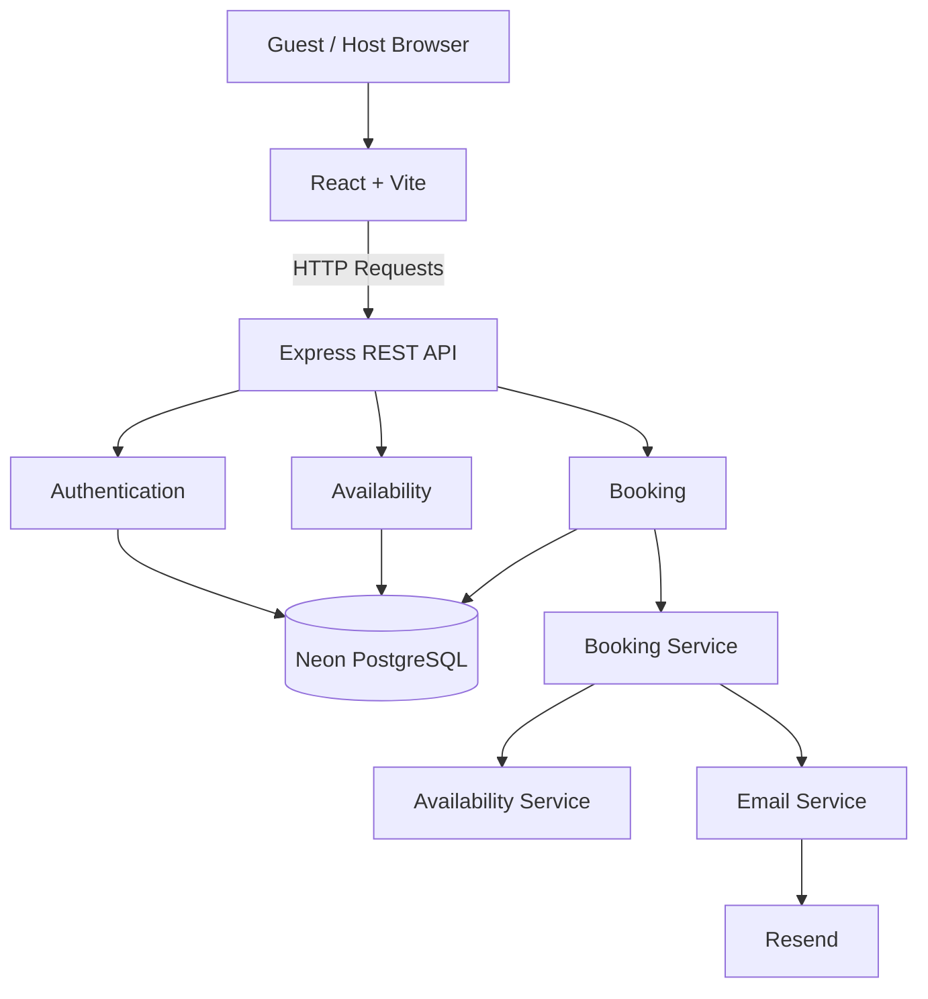
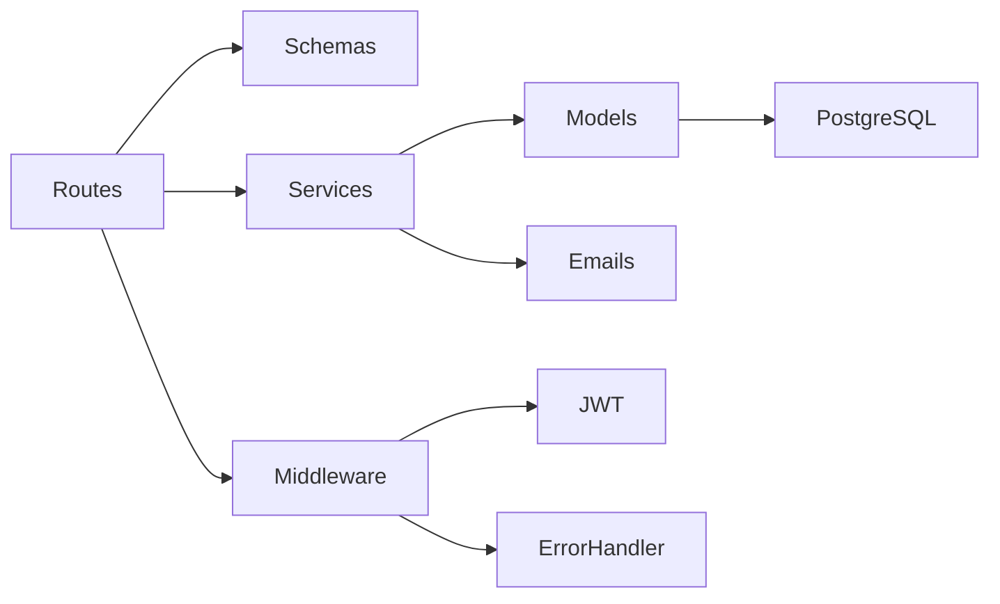
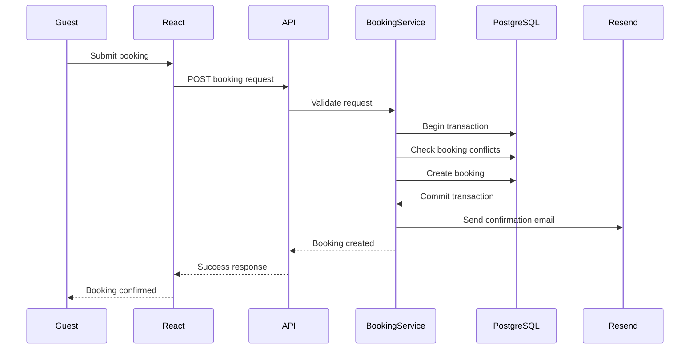

# Calendly Lite

A full-stack scheduling application inspired by Calendly that enables hosts to define weekly availability, share a public booking page, and manage appointments without scheduling conflicts.

The project demonstrates production-style backend architecture, secure JWT authentication, transactional booking workflows, conflict-free scheduling using PostgreSQL exclusion constraints, and automated email notifications.

---

## Live Demo

**Frontend:** https://calendly-lite-khaki.vercel.app/

**Backend API:** https://calendly-lite-api.onrender.com

---

## Features

- Secure JWT authentication
- Weekly availability management
- Public booking page for guests
- Automatic availability-based slot generation
- Conflict-free booking enforced by PostgreSQL exclusion constraints
- Booking cancellation and rescheduling
- Automated email notifications using Resend
- Centralized validation with Zod
- Global Express error handling
- Responsive React frontend

---

## Tech Stack

| Category | Technology |
|----------|------------|
| Frontend | React, Vite, React Router, Context API |
| Backend | Node.js, Express 5, TypeScript |
| Database | Neon PostgreSQL |
| Authentication | JWT, bcrypt |
| Validation | Zod |
| Date & Time | Luxon |
| Email | Resend |
| Deployment | Vercel, Render |

---

# System Architecture



---

## Backend Architecture



---

## Booking Workflow



---

## Project Structure

```
calendly-lite
├── client
│   ├── api
│   ├── components
│   ├── context
│   ├── pages
│   └── utils
│
└── server
    ├── config
    ├── db
    ├── emails
    ├── middleware
    ├── migrations
    ├── models
    ├── routes
    ├── schemas
    ├── services
    └── types
```

---

## REST API

### Authentication

```
POST /api/auth/register
POST /api/auth/login
GET  /api/auth/me
```

### Availability

```
GET    /api/availability
POST   /api/availability
PATCH  /api/availability/:id
DELETE /api/availability/:id
```

### Public Booking

```
GET  /api/public/users/:slug/slots
POST /api/public/users/:slug/bookings
```

### Booking Management

```
GET   /api/bookings
PATCH /api/bookings/:bookingId/cancel
PATCH /api/bookings/:bookingId/reschedule
```

---

## Database Integrity

The application guarantees booking consistency at the database layer.

Confirmed bookings are protected by a PostgreSQL **exclusion constraint** using `tstzrange`, preventing overlapping bookings for the same host—even under concurrent requests.

Booking creation executes inside a database transaction to ensure that bookings are committed only after all validation and conflict checks succeed.

Cancelled bookings are excluded from the overlap constraint, allowing those time slots to become available again.

---

## Engineering Highlights

- Layered backend architecture separating routing, validation, business logic, persistence, and middleware.
- Database-enforced conflict prevention using PostgreSQL exclusion constraints.
- Transactional booking workflow for booking creation, cancellation, and rescheduling.
- Timezone-aware slot generation using Luxon.
- Centralized request validation and API error handling with Zod.
- Automated booking emails using Resend.

---

## Local Development

Clone the repository:

```bash
git clone <repository-url>
cd calendly-lite
```

### Backend

```bash
cd server
npm install
```

Create a `.env` file:

```env
DATABASE_URL=
JWT_SECRET=
CLIENT_URL=
RESEND_API_KEY=
EMAIL_FROM=
PORT=3000
```

Run the server:

```bash
npm run dev
```

### Frontend

```bash
cd client
npm install
npm run dev
```

---

## Future Improvements

- Google Calendar integration
- OAuth authentication
- Buffer time between meetings
- Multiple availability windows per day
- Custom meeting durations
- Calendar invitations (.ics)
- Reminder emails
- Host profile customization

---

